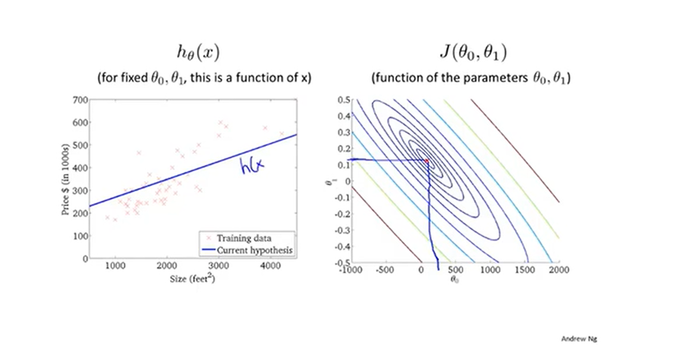
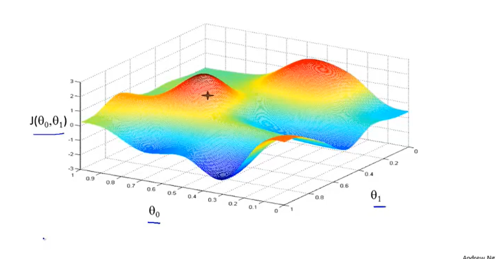
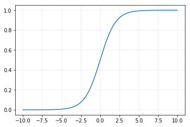
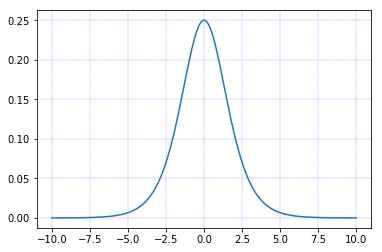
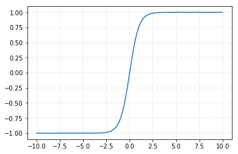
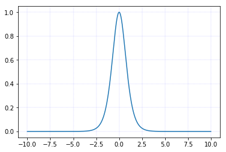
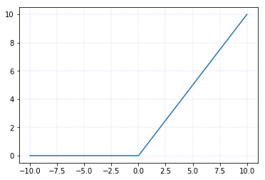
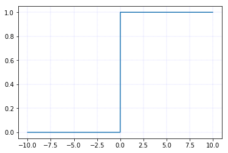

## 学习资源

[吴恩达课堂优秀笔记](https://blog.csdn.net/weixin_36815313/article/details/105267247)

## 基础知识入门

### 机器学习的定义

- Arthur Smauel(1959). Machine learning: Field of study that gives computers the ability to learn without being explicitly programmed

- Tom Mitchell(1998). Well-posed Learning Problem: A computer program is said to learn from experience E with respect to some task T and some performance measure P, if its performance on T, as measured by P, improves with exprience E.

  > what's E? for example: in the occassion to filter spam, the E is watching you label emails as spam or not spam

1. 监督学习

   example: house pricing、tumor size

   regression：处理连续情形

   classification：处理离散的情形

2. 无监督学习

   区别：训练数据有无label

   聚类就是一种无监督的学习-谷歌新闻：组成一个一个的新闻专题

   > don't tell the algorithm in advance what the classification is, can you find some structure in the data
   >
   > 注意，无监督学习并不是只有聚类算法

   example：基因检查、social network analysis、market segmentation、天文学（星系理论）

   鸡尾酒算法：被叠加在一起的声音

### 重要思想——梯度下降

几个注意点：

- 梯度下降的时候是假定其他参数都不变的情形下来计算
- 如果起点不同，可能会收敛到一个完全不同的局部最优点

单个样本的梯度下降：

$\frac{d L}{dw}=\frac{dz}{dw}\frac{dL}{dz}=\frac{dz}{dw}\frac{da}{dz}\frac{dL}{da}=xa(1-a)(-\frac{y}{a}+\frac{1-y}{1-a})$

m个样本的梯度下降：

带有求和的全局损失函数，实际上是1到m项各个损失的平均。即全局损失函数(除以m后)对w的微分，也同样是各项损失对w的微分的平均

### 几个常用的激活函数

- sigmoid函数：主要用于==二分类==的==输出层==，否则不用

  - $sigmoid(z) = \frac{1}{1+e^{-z}}$

    

  - $sigmoid'(z)=\frac{e^{-z}}{(1+e^{-z})^2}=sigmoid(x)(1-sigmoid(x))$

    

- tanh函数：双曲正切函数，几乎所有的场合均可以

  - $\tanh(x)=\frac{\sinh(x)}{\cosh(x)}=\frac{\frac{e^{z}-e^{-z}}{2}}{\frac{e^{z}+e^{-z}}{2}}=\frac{e^{z}-e^{-z}}{e^{z}+e^{-z}}$

    

  - $tanh'(x)=1-tanh^2(x)$

    

- ReLU(Rectified Linear Unit 修正的线性单元)：二分类问题选择sigmoid，余下的问题ReLU是默认的选择

  - $f(x)=\begin{cases}x,&x \ge 0\\0,&x<0\end{cases}$

    

  - $f(x)=\begin{cases}1,&x\ge0\\0,&x<0\end{cases}$

    

    

- leaky ReLU（带泄露的ReLU）

  - $f(x)=\begin{cases}x,&x\ge0\\\lambda x,&x<0\end{cases} ,0<\lambda<1$

    .png)

  - $f'(x)=\begin{cases}1,&x\ge0\\\lambda,&x<0\end{cases}$

    .png)

### 损失函数

$\begin{cases}y=1:&p(y|x)=\hat{y}\\y=0:&p(y|x)=1-\hat{y}\end{cases}\Rightarrow p(y|x)=\hat{y}^y(1-\hat{y})^{1-y}$

根据线性性质，最大化$p(y|x)$（`为什么要最大化p(y|x)：最大的概率预测这个值`)等价于$-log(p(y|x))$最小化	$\Leftarrow$ 单个样本

$P(Y|X)=\log\prod_{i=1}^mp(y^{(i)}|x^{(i)})=\sum_{i=1}^m\log P(y^{(i)}|x^{(i)})=\sum_{i=1}^{m}-L(\hat{y}^{(i)},y^{(i)})$`基于独立同分布的假设`	$\Leftarrow$ 数据集

$J(w,b)=\frac{1}{m}\sum_{i=1}^{m}L(\hat{y}^{(i)},y^{(i)})$

### 重要思想——前项传播和反向传播

